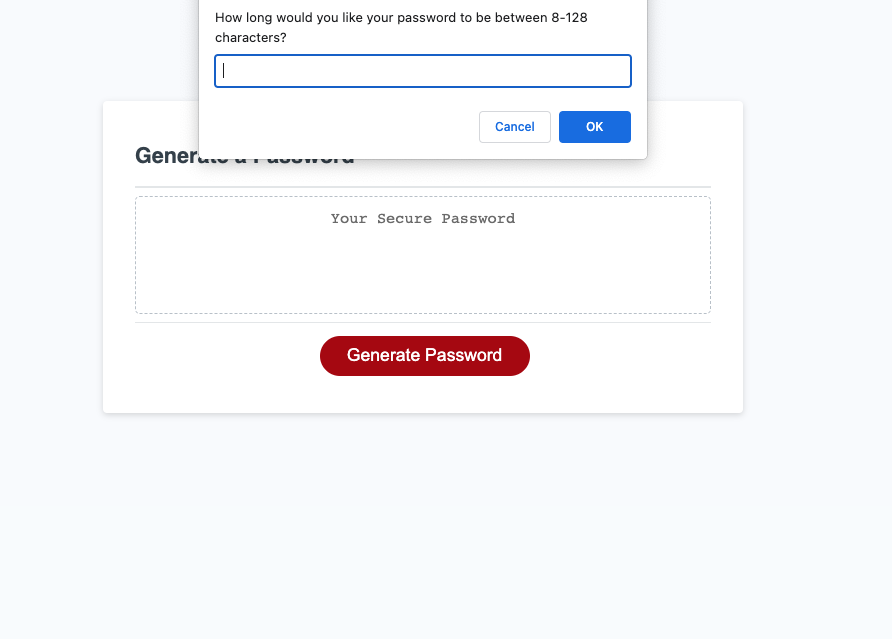
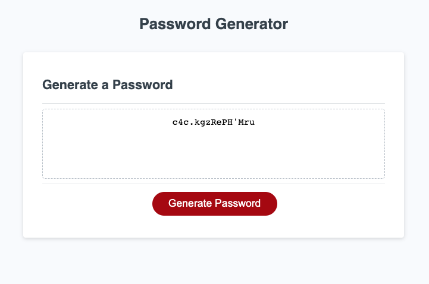

# Password-Generator

This is a simple password generator application that allows users to generate a secure password based on their selected criteria. The app will prompt the user for the length of the password, and whether or not to include lowercase, uppercase, numbers, and/or special characters. The generated password will then be displayed on the screen.

# Getting Started
To view my password generator visit https://turboteam335.github.io/Password-Generator/.  
To use the password generator, click the "Generate Password" button on the screen. You will then be prompted asking if you would like a random password. After clicking ok you be asked to select the length of your password, and whether or not to include lowercase, uppercase, numeric, and/or special characters. Once you've made your selections, click the "Generate" button to create your password. The generated password will be displayed on the screen, and you can copy and paste it as needed.

# Technologies Used
My password generator was built using JavaScript 

# Features 
- Functions: Several functions in your code were used to accomplish different tasks, such as prompting the user for input, validating the user's input, and generating the password itself.

- Conditional statements: if/else statements were used to validate the user's input and ensure that at least one if not several type of character were selected for the password.

- Loops: I used a while loop to validate the user's input for the length of the password, to ensure that the user entered a number between 8 and 128.

- Arrays: Arrays were used to store the different types of characters that can be used to generate the password.

- Math: I used Math.random() and Math.floor() to select random characters from the arrays.

- String concatenation: I used string concatenation to build the final password string